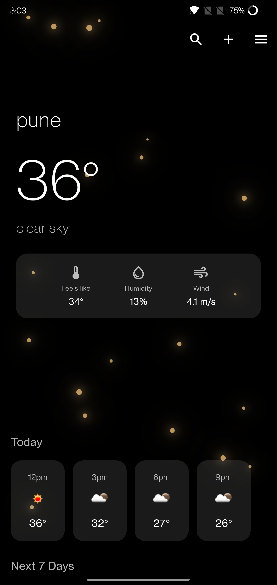

# Weather App

A modern, minimalist weather application built with Flutter that provides real-time weather information with a beautiful user interface.



## Features

- Real-time weather data
- Hourly and 7-day forecasts
- Multiple city management
- Location-based weather
- Beautiful particle animation background
- Pull-to-refresh functionality
- City search and favorites
- Detailed weather information including:
  - Temperature
  - Feels like temperature
  - Humidity
  - Wind speed
  - Weather conditions

## Getting Started

### Prerequisites

- Flutter SDK (3.6.1 or higher)
- Dart SDK (3.0.0 or higher)
- OpenWeatherMap API key

### Installation

1. Clone the repository
```bash
git clone https://github.com/yourusername/weather_app.git
```

2. Navigate to the project directory
```bash
cd weather_app
```

3. Install dependencies
```bash
flutter pub get
```

4. Update the API key in `lib/services/weather_service.dart`:
```dart
static const String apiKey = 'YOUR_API_KEY';
```

5. Run the app
```bash
flutter run
```

## Configuration

### API Key
Get your API key from [OpenWeatherMap](https://openweathermap.org/api) and replace it in the WeatherService class.

### Location Services
The app requires location permissions for automatic city detection. Ensure you have the following permissions in your manifest files:

#### Android
```xml
<uses-permission android:name="android.permission.ACCESS_FINE_LOCATION" />
<uses-permission android:name="android.permission.ACCESS_COARSE_LOCATION" />
```

#### iOS
Add the following to your Info.plist:
```xml
<key>NSLocationWhenInUseUsageDescription</key>
<string>This app needs access to location to show your local weather.</string>
```

## Architecture

The app follows a simple, clean architecture:
- `models/` - Data models
- `services/` - API and local storage services
- `screens/` - UI screens
- `widgets/` - Reusable widgets

## Dependencies

- `http`: ^1.1.0 - API requests
- `intl`: ^0.18.1 - Date formatting
- `weather_icons`: ^3.0.0 - Weather icons
- `geolocator`: ^10.1.0 - Location services
- `geocoding`: ^2.1.1 - Location name lookup
- `shared_preferences`: ^2.2.2 - Local storage
- `flutter_launcher_icons`: ^0.13.1 - App icon generation

## Performance Optimizations

- Image caching for weather icons
- Weather data caching
- Optimized SharedPreferences access
- Reduced particle count for smooth animations
- RepaintBoundary for efficient rendering

## Contributing

1. Fork the repository
2. Create your feature branch (`git checkout -b feature/AmazingFeature`)
3. Commit your changes (`git commit -m 'Add some AmazingFeature'`)
4. Push to the branch (`git push origin feature/AmazingFeature`)
5. Open a Pull Request


## Acknowledgments

- Weather data provided by [OpenWeatherMap](https://openweathermap.org/)
- Icons from [Material Design Icons](https://material.io/icons/)

## Contact

Harsh Mali - harshsachinmali8@gmail.com

Project Link: [https://github.com/harsh-mali/weather_app](https://github.com/harsh-mali/weather_app)
"# weather_app" 
"# weather_app" 
